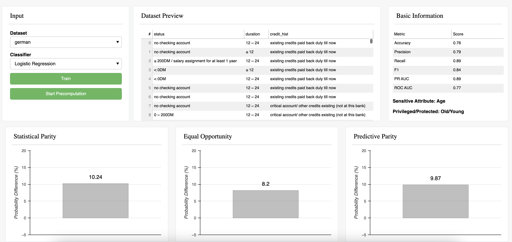
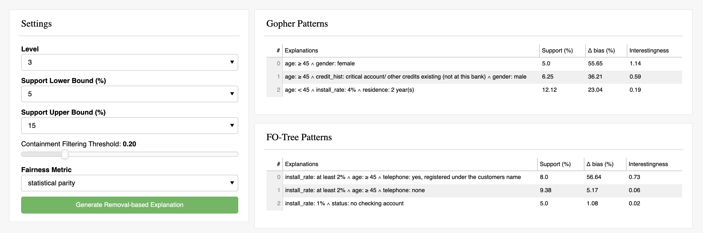
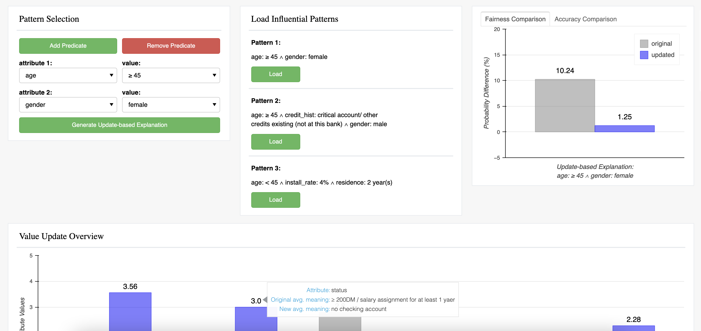

# Source code of demo of Gopher

## Several Steps to Run the Demo

- Install [Bokeh](https://docs.bokeh.org/en/latest/)
- Clone this repo: ```git clone https://github.com/lodino/gopher-demo```
- Enter the directory: ```cd gopher-demo```
- Run ```bokeh serve --show gopher-demo-dev```

## Screenshots of the Demo




## Useful Links

* [Project Website](https://gopher-sys.github.io/)
* [Research Paper](https://dl.acm.org/doi/10.1145/3514221.3517886)
* [Demo Paper](https://dl.acm.org/doi/abs/10.1145/3514221.3520170)
* [Tech Report](https://arxiv.org/abs/2112.09745)

## Citation
Please cite our papers if you are using the code in your research.
```
@article{pradhan2021interpretable,
  title={Interpretable data-based explanations for fairness debugging},
  author={Pradhan, Romila and Zhu, Jiongli and Glavic, Boris and Salimi, Babak},
  journal={arXiv preprint arXiv:2112.09745},
  year={2021}
}

@inproceedings{zhu2022generating,
  title={Generating Interpretable Data-Based Explanations for Fairness Debugging using Gopher},
  author={Zhu, Jiongli and Pradhan, Romila and Glavic, Boris and Salimi, Babak},
  booktitle={Proceedings of the 2022 International Conference on Management of Data},
  pages={2433--2436},
  year={2022}
}
```
